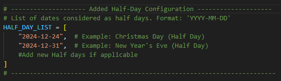

# Odoo Time Tracking Tool

A Telegram bot for tracking and visualizing work hours from Odoo.

## Stable Releases

### v2.1.0 (Current)
- Enhanced user credential persistence
- Improved work schedule management
- Support for multiple user configurations
- Better timezone handling (Europe/Berlin)
- Refined error messages and validation

### v2.0.0
- Improved error handling for invalid or expired credentials
- Added clear error messages for authentication failures
- Fixed "File is not a zip file" error handling
- Set timezone to CET (Berlin Time)
- Added validation for session ID and CSRF token formats
- Better HTTP error handling with specific messages

### v1.0.0
- Full-time and part-time work schedule options
- Custom work schedules
- Progress tracking with visual indicators
- Holiday tracking
- Leave management
- Weekly and monthly reports
- PDF visualization of work hours
- Credential persistence between restarts

## Features
- Track work hours from Odoo
- Generate weekly and monthly reports
- Visualize work hours with charts
- Support for different work schedules
- Holiday and leave tracking
- Progress monitoring
- Secure credential management

## Setup
1. Set your credentials using `/credentials`
2. Set your work schedule using `/work_schedule`
3. Generate reports using `/month`, `/week`, or `/status`

## Commands
- `/start` - Start the bot and show main menu
- `/month` - Generate report for current month
- `/week` - Generate report for current week
- `/custom YYYY-MM` - Generate report for specific month
- `/status` - Show current status without PDF
- `/credentials` - Set your Odoo credentials
- `/work_schedule` - Set your work schedule
- `/help` - Show help message

## Requirements
See `requirements.txt` for Python package dependencies.

## Environment Variables
- `TELEGRAM_BOT_TOKEN` - Your Telegram bot token
- `HEROKU_API_KEY` - Your Heroku API key
- `HEROKU_APP_NAME` - Your Heroku app name
- `TZ` - Timezone (set to Europe/Berlin)

## Deployment
The bot is deployed on Heroku and uses environment variables for configuration.

---

Adapted from Fabian Mildner 
# Description of New Changes in the Code

## 1. **Custom Month-Based Check**
- Added functionality to analyze data for a specific month by specifying a custom month (`yyyy-mm`).
- This mode is mutually exclusive with other date range options like weekly or monthly analysis.
- Dynamically determines the start and end dates for the specified month.

## 2. **Holiday Fix**

### Holiday Extraction:
- Integrated regional holiday data extraction from ICS files.
- Holidays are now filtered based on:
  - Region-specific applicability (e.g., Bundesland).
  - Relevant date ranges.

### Double Counting Fix:
- Resolved issues where holidays overlapping with vacation leaves were being counted twice.
- Adjustments ensure accurate calculation of expected work hours after accounting for holidays and leaves.

---

## 3. **New Feature: Half Day Handling**

### Half-Day Configuration:
- Introduced configurable half-day support for specific dates (e.g., Christmas Eve, New Year's Eve).
- Automatically adjusts expected work hours to account for half days.

### Implementation:
- Half days are included in the calculations with appropriate adjustments to total work hours.

---

## 4. **Visualization Enhancements**

### Daily Work Hours Plot:
- Added a new section to display half-day hours in the daily work hours plot.
- Overtime and undertime differences are labeled for better clarity.

### Cumulative Work Hours Plot:
- Enhanced annotations to show cumulative differences between expected and actual work hours.

---

## 5. **Detailed Output**

### Reports:
- Lists all holidays, leaves, and half days with corresponding accounted hours.
- Provides a detailed weekly breakdown of total hours worked.

---

- Will give a comprehensible report of all events

## 6. **General Improvements**

### Flexible Date Range Handling:
- Enhanced support for weekly, monthly, and custom date ranges.

### Improved Argument Validation:
- Ensures mutual exclusivity of options and prevents conflicting inputs.

## 7. ** Half Day and Vacation or Sick day Conflict**:
- Conditional Check Before Adding Half-Day Hours:

  Purpose: To prevent adding half-day hours on days that are already marked as vacation, sick days, or special leave.

---

This update improves accuracy in reporting, resolves edge cases for holidays and leaves, and introduces robust support for half-day handling and custom month analysis.
